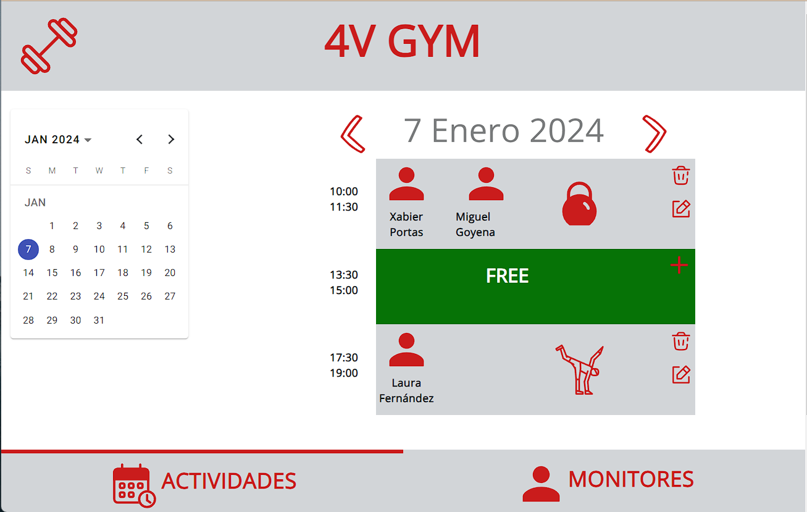
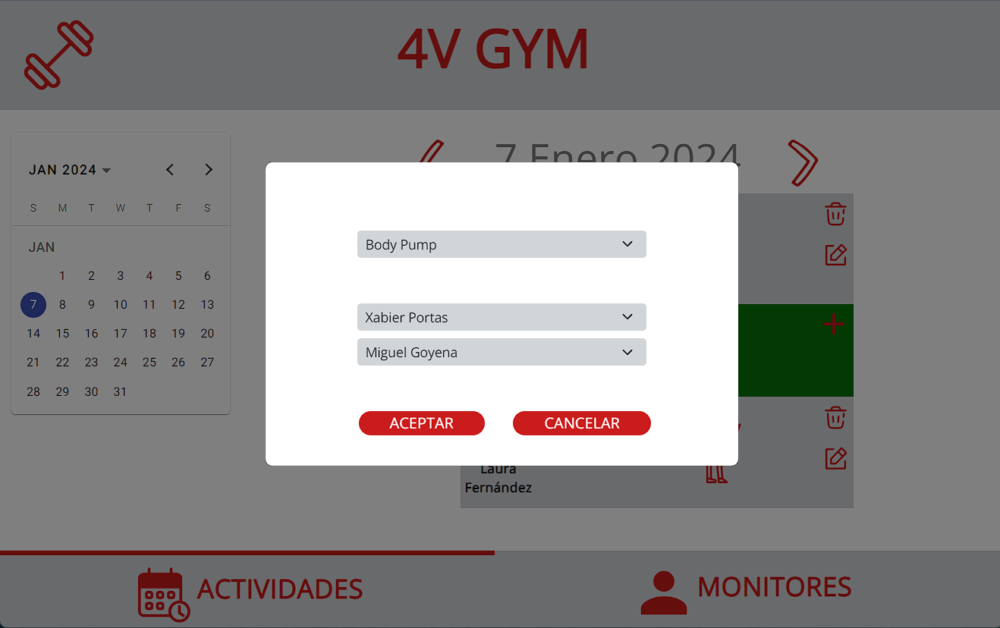
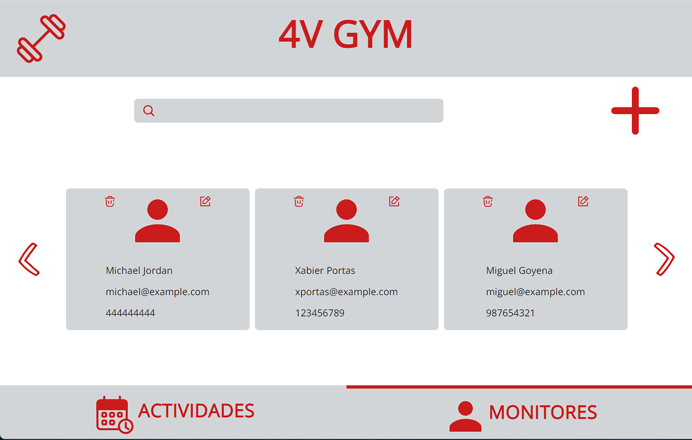
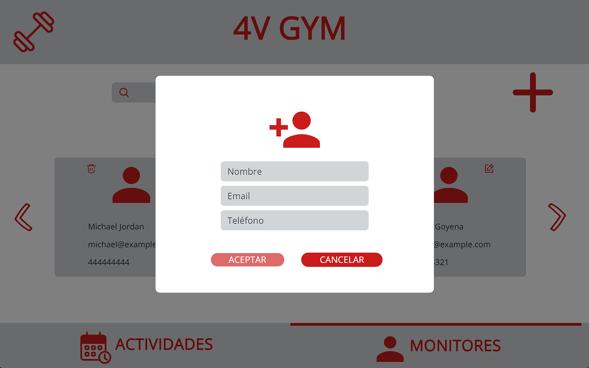

# 4V-GYM Web Interface README

## Application Description

The 4V-GYM web interface is a platform developed in Angular 17 and Bootstrap 5 that allows managing activities and monitors in a gym. The application provides an intuitive and efficient interface for operations such as scheduling, editing, deleting, and viewing activities, as well as managing monitors.

<table>
  <tr>
    <td></td>
    <td></td>
  </tr>
  <tr>
    <td></td>
    <td></td>
  </tr>
</table>

## Technologies Used

- **Angular 17**: Web development framework used to build the user interface and manage the "single page application" logic of the web.
- **Bootstrap 5**: CSS framework used to enhance the appearance and responsiveness of the interface.
- **TypeScript**: Programming language used to write client-side code.
- **Services**: Backend implemented through services that initialize when the web application starts.

## Components Structure

1. **`app.component.ts`**: Main component that imports and organizes other components. It includes the web header (`navbartop`) and the bottom navigation bar (`navbarbottom`) to facilitate navigation.

2. **`services`**:
   - **`instructor.service.ts`**: Service handling data and operations related to monitors.
   - **`activities.service.ts`**: Service managing data and operations related to activities.

3. **`navbartop`**: Component containing the web header, including the gym's title and logo.

4. **`navbarbottom`**: Component containing links to navigate between monitors and activities screens.

5. **`datepicker`**: Component including the calendar to select the date and the gym's activity board (`dailyboard`). Additionally, it contains the `carousel` element with a filter to search for specific monitors.

6. **`dailyboard`**: Board showing activities for the selected day, with details such as activity type, time, and monitors leading the classes.

7. **`carousel`**: Component displaying the current gym monitors in a carousel mode. It includes a search feature to facilitate finding specific monitors.

8. **`modals`**:
   - **`modalinstructor`**: Modal containing the form to create and edit new instructors.
   - **`modalactivity`**: Modal containing the form to create and edit new activities.

## Application Usage

The application consists of two main sections: Activities and Monitors. Users can navigate between these sections using the bottom navigation bar. On the Activities page, a date can be selected to manage activities for the day, including viewing, editing, and deleting. On the Monitors page, monitors can be viewed, created, edited, and deleted.

For data management, the application uses services (`instructor.service` and `activities.service`) that initialize when the web application starts.

## Developer Information

### Continuing Development

### Prerequisites

Ensure [Node.js](https://nodejs.org/) is installed on your system before continuing with the application development.

### Development Environment Setup

1. **Clone the Repository:**
   ```bash
   git clone https://github.com/yourusername/4V-GYM-Web-Interface.git
   ```

2. **Install Dependencies:**
   ```bash
   cd 4V-GYM-Web-Interface
   npm install
   ```

### Development Environment

During development, you can use the Angular development server to preview changes in real-time. Run the following command in the terminal:

```bash
ng serve
```

Visit `http://localhost:4200/` in your browser to see the application in development mode.

### Project Structure

The project structure is based on components and services. As you continue development, you can expand functionality or add new features following the existing structure.

### Creating New Components

To add new components, you can use the following Angular CLI command:

```bash
ng generate component component-name
```

This will automatically create the necessary files and set up the new component in the project structure.

### Updating Services

If it's necessary to add new operations or modify the logic of existing services, you can do so in the `instructor.service.ts` and `activities.service.ts` files. Ensure consistency between services and the components that use them.

### Deployment

Once you have made the necessary changes and are satisfied with the application, you can prepare it for production and deploy it on a server. Use the following command to compile the application for production:

```bash
ng build --prod
```

The resulting files will be in the `dist/` directory.

### Collaboration

If multiple developers are working on the project, consider create your own branch and redirect the application to a new level!
